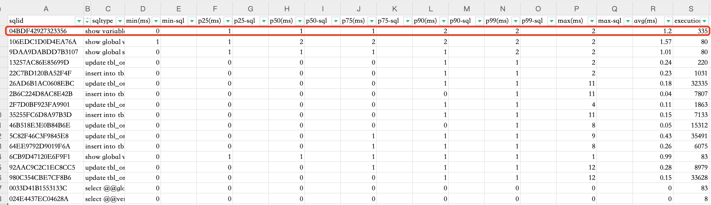
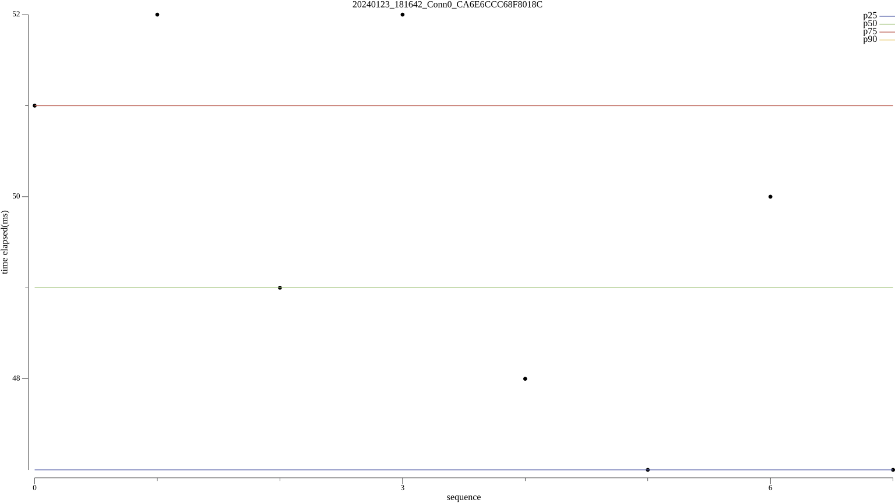

[简体中文](./README.md)|[English](./README_EN.md)

# sqlreplayer
retrieve raw SQL queries from MySQL's general log, slow log, and CSV files, and replay them on multiple databases that support the MySQL protocol to generate statistical analysis reports on SQL execution.

analyze part support general log,slow log in mysql 5.6,5.7,8.0 

# why sqlreplayer

The initial intention of using this tool is to compare the performance differences of SQL under multiple databases, and generate simple comparison results. 
It mainly involves two parts. One is SQL collection, the tool supports collecting raw SQL from MySQL's full logs, slow logs, and CSV files for aggregation. The other is SQL replay, SQL replay supports replaying raw SQL on multiple data sources and obtaining comparison results.

# install

Execute 'go build' in sqlreplayer

# mode

analyze：generate raw sql from general log,slow log or csv which can be used in sql replay  
replay：replay raw sql on data sources  
both：combine of analyze and replay  

## analyze 

generate raw sql from general log,slow log or csv which can be used in sql replay

> ./sqlreplayer -exec analyze -f test_general_1.log -logtype genlog  
[analyze]2023/12/28 17:20:50 begin to read genlog test_general_1.log  
[analyze]2023/12/28 17:20:50 finish reading genlog test_general_1.log  
[analyze]2023/12/28 17:20:50 raw sql save to 20231228_172050_rawsql.csv  

you can also grasp raw sql in a period of time. Folowing sample will generate raw sql which is executed between 10:00 and 10:30.

>./sqlreplayer -exec analyze -f slow_8.0.log -logtype slowlog -begin "2024-01-01 10:00:00" -end "2024-01-01 10:30:00" 

When analyzing the original SQL, simple statistics are conducted according to the SQLID distribution with "-generate-report".

>./sqlreplayer -exec analyze -f slow.log -logtype slowlog -generate-report  
[analyze]2024/01/15 11:03:26 begin to read slowlog slow.log  
[analyze]2024/01/15 11:03:26 finish reading slowlog slow.log  
[analyze]2024/01/15 11:03:26 raw sql save to 20240115_110326_rawsql.csv  
[analyze]2024/01/15 11:03:26 raw sql save to 20240115_110326_analyze_report.csv  

"20240115_110326_rawsql.csv" saves info from log, including original sql,elapsed time.
"20240115_110326_analyze_report.csv" is a brief statistics of sql log by templating the sql. Below is a screenshot of "20240115_110326_analyze_report.csv".

>Col A is sqlid,identification of the sql after templating. B is sql alfter templating. D is minimum elasped time. E is the raw sql that takes the least amount of time. (in order to show the raw sql,you need set -save-raw-sql parameter, but it will take up more memory, depending on the total amount of SQL executed by the logs)。From F to O,p25,p50,p75,p99 represent the execution time quantiles of the SQL template. Task 04BDF42927323356 as an example, it  was executed 335 times, with 99% of the executions taking less than 2 milliseconds.

## replay 

for example, the following command line is to replay sql in data sources ip1:port1 and ip2:port2

>./sqlreplayer -exec replay -f test.csv -conn  'user1:passwd1:ip1:port1:db1,user2:passwd2:ip2:port2:db2'  
[init]2023/12/28 16:57:02 conn 0 [user1:passwd1:ip1:port1:db1]  
[init]2023/12/28 16:57:02 conn 1 [user2:passwd2:ip2:port2:db2]  
[replay]2023/12/28 16:57:08 reach the end of log file.  
[replay]2023/12/28 16:57:14 sql replay finish ,num of raw sql 3,time elasped 12.573019s  
[replay]2023/12/28 16:57:14 save replay result to 20231228_173023_replay_stats.csv

here is content of test.csv, all about the sql needed to replay. You can generate such csv file with "analyze" command or maintain it manually.
>"select 1,sleep(1)"  
"select 2,sleep(2)"  
"select 3,sleep(3)"  
"select 1"  
"select 2"  
"select 3"  

replay statistic will be generated as shown below.

sql will be grouped according to sqlid, and you can have a glance of sql's performance among all data sources.

| sqlid            | sqltype | conn_0_min(ms) | conn_0_min-sql | conn_0_p99(ms) | conn_0_p99-sql | conn_0_max(ms) | conn_0_max-sql | conn_0_avg(ms) | conn_0_execution | conn_1_min(ms) | conn_1_min-sql | conn_1_p99(ms) | conn_1_p99-sql | conn_1_max(ms) | conn_1_max-sql | conn_1_avg(ms) | conn_1_execution |
|------------------|---------|----------------|----------------|----------------|----------------|----------------|----------------|----------------|------------------|----------------|----------------|----------------|----------------|----------------|----------------|----------------|------------------|
| 16219655761820A2 |         | 44             | select 1       | 44             | select 2       | 45             | select 3       | 44.33          | 3                | 44             | select 2       | 44             | select 3       | 45             | select 1       | 44.33          | 3                |
| EE3DCDA8BEC5E966 |         | 1189           | select 1,sleep(1) | 2046           | select 2,sleep(2) | 3047           | select 3,sleep(3) | 2094.00        | 3                | 1186           | select 1,sleep(1) | 2046           | select 2,sleep(2) | 3048           | select 3,sleep(3) | 2093.33        | 3                |

>The above is similar to those generated in the analysis phase's analyze_report. The first row represents the execution results of SQLID 16219655761820A2 across various data sources. "conn_0_execution" indicates that this type of SQL was executed 3 times on conn0, and "conn_0_p99(ms)" indicates that 99% of the execution times on conn0 were less than or equal to 44 milliseconds. The SQL corresponding to the 99th percentile is "select 1". This allows for an intuitive comparison of the SQL execution results across different data sources.

other parameters

>-m: number of times a raw sql to be executed while replaying,default 1  
-threads: thread num while replaying,default 1
-select-only: replay select statement only,default false
-sql-type: replay statement [query|dml|ddl|all], more than one type can be specified by comma,default value is query,in this mode, only replay query statement
-charset: charset of connection, default utf8mb4

## both

"both" combines the analyze and replay stages, directly replaying raw SQL statements collected from logs under the configured data source after the collection process.

# parameters introduction

  -exec string  
        exec type [analyze|replay|both]
        analyze:generate raw sql from log file.
        replay:replay raw sql in connections.

## analyze

  -begin string  
        filter sql according to specified begin time from log,format 2023-01-01 13:01:01 (default "0000-01-01 00:00:00")
  -end string  
        filter sql according to specified end time from log,format 2023-01-01 13:01:01 (default "9999-12-31 23:59:59")
  -f string  
        filename
  -generate-report  
        generate report for analyze phrase
  -save-raw-sql  
        save raw sql in report
  -logtype string  
        log type [genlog|slowlog|csv]

## replay
 -charset string  
        charset of connection (default "utf8mb4")

 -conn string  
        mysql connection string,support multiple connections seperated by ',' which can be used for comparation,format user1:passwd1:ip1:port1:db1[,user2:passwd2:ip2:port2:db2]

  -f string  
        filename

  -m int  
        number of times a raw sql to be executed while replaying (default 1)
  -sql-mode
        replay statement [query|dml|ddl|all], moer than one type can be specified by comma, for example query,ddl,default:query
  -threads int  
        thread num while replaying (default 1)
  -save-raw-sql  
        save raw sql in report
  -draw-pic  
        draw elasped picture for each sqlid

  -dry-run  
        replay raw sql without collecting any extra info
