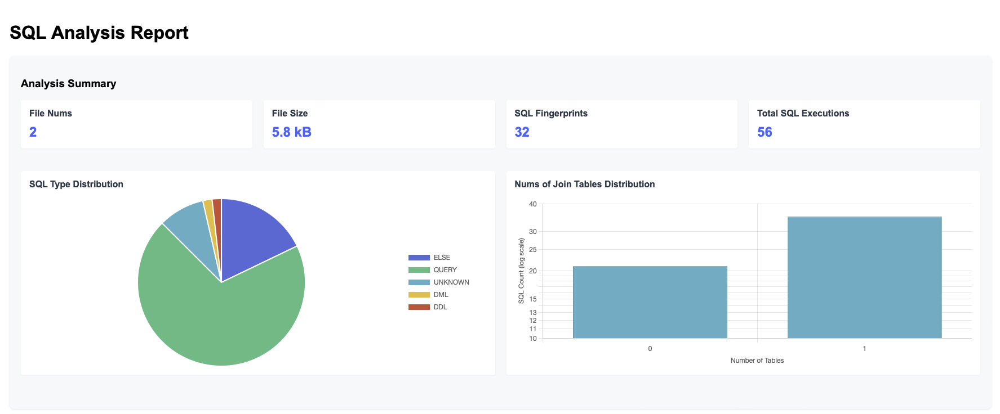
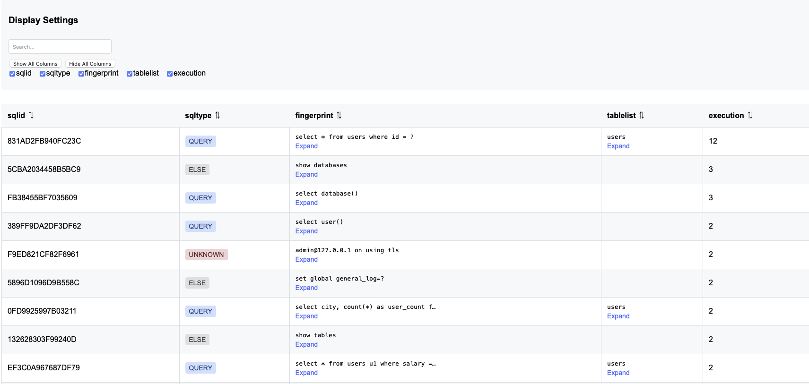
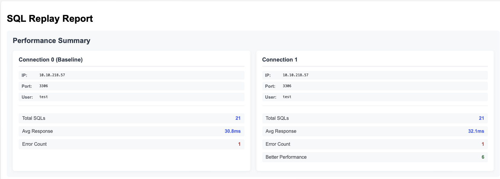
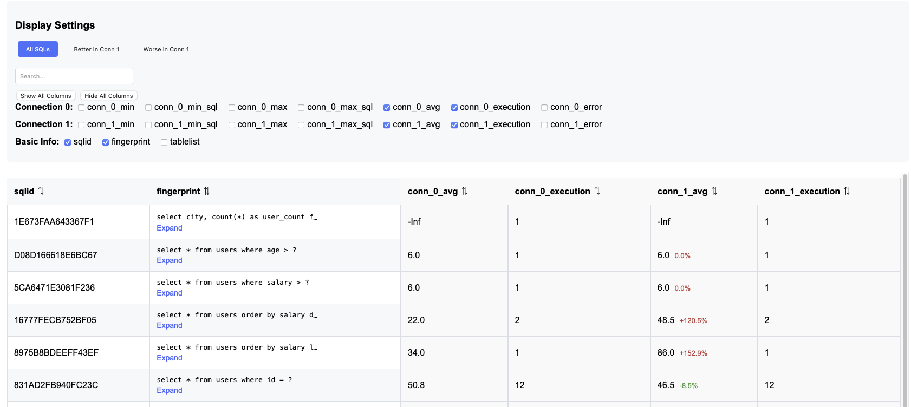

[简体中文](./README.md)|[English](./README_EN.md)

# sqlreplayer
retrieve raw SQL queries from MySQL's general log, slow log, and CSV files, and replay them on multiple databases that support the MySQL protocol to generate statistical analysis reports on SQL execution.

analyze part support general log,slow log in mysql 5.6,5.7,8.0 

# why sqlreplayer

The initial intention of using this tool is to compare the performance differences of SQL under multiple databases, and generate simple comparison results. 
It mainly involves two parts. One is SQL collection, the tool supports collecting raw SQL from MySQL's full logs, slow logs, and CSV files for aggregation. The other is SQL replay, SQL replay supports replaying raw SQL on multiple data sources and obtaining comparison results.

# mode

analyze：generate raw sql from general log,slow log or csv which can be used in sql replay  
replay：replay raw sql on data sources  
both：combine of analyze and replay  

## analyze 

generate raw sql from general log,slow log or csv which can be used in sql replay, it will also genarate a brief sql report for these log.

  

    
    

            SQL Analysis Report Example Part 1 - Shows SQL type distribution and table join statistics
    

  

  

    
    

            SQL Analysis Report Example Part 2 - Shows SQL types and execution statistics
    

  

  

    <a href="example/rawsql_analyze_report.html" style="display: inline-block; padding: 12px 24px; background-color: #007bff; color: white; text-decoration: none; border-radius: 4px; font-weight: bold; transition: background-color 0.3s;">
      👉 View Complete Analysis Report
    </a>
  

## replay 

replay mode will replay sql The replay mode will replay the SQL in the specified database and generate a replay report.

  

    
    

            SQL Replay Report Example Part 1 - Shows basic SQL replay overview
    

  

  

    
    

            SQL Replay Report Example Part 2 - Shows SQL replay details
    

  

  

    <a href="example/replay_stats.html" style="display: inline-block; padding: 12px 24px; background-color: #007bff; color: white; text-decoration: none; border-radius: 4px; font-weight: bold; transition: background-color 0.3s;">
      👉 View Complete Replay Report
    </a>
  

## both

"both" is combination of "analyze" and "replay"

# Quick Start

cd cmd  
make  
./sqlreplayer -config config_analyze_demo.yaml  
> Using configuration file: config_analyze_demo.yaml  
2025-03-06T17:18:06.335 [info] sqlreplayer/sqlreplayer.go:492 worker 3 start.  
2025-03-06T17:18:06.335 [info] sqlreplayer/sqlreplayer.go:492 worker 1 start.  
2025-03-06T17:18:06.335 [info] sqlreplayer/sqlreplayer.go:492 worker 2 start.  
2025-03-06T17:18:06.335 [info] sqlreplayer/sqlreplayer.go:722 begin to analyze general_sample.log from pos 0  
2025-03-06T17:18:06.335 [info] sqlreplayer/sqlreplayer.go:502 worker 2 exit.  
2025-03-06T17:18:06.335 [info] sqlreplayer/sqlreplayer.go:492 worker 0 start.  
2025-03-06T17:18:06.335 [info] sqlreplayer/sqlreplayer.go:502 worker 0 exit.  
2025-03-06T17:18:06.335 [info] sqlreplayer/sqlreplayer.go:722 begin to analyze general_sample_2.log from pos 0  
2025-03-06T17:18:06.340 [info] sqlreplayer/sqlreplayer.go:539 finish parse GENLOG general_sample_2.log  
2025-03-06T17:18:06.340 [info] sqlreplayer/sqlreplayer.go:502 worker 1 exit.  
2025-03-06T17:18:06.340 [info] sqlreplayer/sqlreplayer.go:539 finish parse GENLOG general_sample.log  
2025-03-06T17:18:06.340 [info] sqlreplayer/sqlreplayer.go:502 worker 3 exit.  
2025-03-06T17:18:06.346 [info] sqlreplayer/sqlreplayer.go:1484 Raw SQL report saved to ./test/sqlreplayer_task_20250306171806/rawsql_analyze_report.html  
2025-03-06T17:18:06.346 [info] sqlreplayer/sqlreplayer.go:595 task finished.  
2025-03-06T17:18:06.346 [info] sqlreplayer/sqlreplayer.go:606 Memory statistic   
2025-03-06T17:18:06.346 [info] sqlreplayer/sqlreplayer.go:607 Allocated Memory: 1655 KB  
2025-03-06T17:18:06.346 [info] sqlreplayer/sqlreplayer.go:608 Total Allocated Memory: 4488 KB  
2025-03-06T17:18:06.346 [info] sqlreplayer/sqlreplayer.go:609 Heap Memory: 1655 KB  
2025-03-06T17:18:06.346 [info] sqlreplayer/sqlreplayer.go:610 Heap Memory System: 7648 KB  
2025-03-06T17:18:06.346 [info] sqlreplayer/sqlreplayer.go:611 MaxHeapAlloc: 3128 KB  
2025-03-06T17:18:06.346 [info] sqlreplayer/sqlreplayer.go:613 exit.  

More usage can be referenced in the configuration of the demo.yaml file.

# parameters introduction

  -exec string  
        exec type [analyze|replay|both]
        analyze:generate raw sql from log file.
        replay:replay raw sql in connections.

## analyze

  -begin string  
        filter sql according to specified begin time from log,format 2023-01-01 13:01:01 (default "0000-01-01 00:00:00")
  -end string  
        filter sql according to specified end time from log,format 2023-01-01 13:01:01 (default "9999-12-31 23:59:59")
  -filelist string  
        filename,multiple file seperated by ','  
  -generate-report  
        generate report for analyze phrase
  -save-raw-sql  
        save raw sql in report
  -logtype string  
        log type [genlog|slowlog|csv]

## replay
 -charset string  
        charset of connection (default "utf8mb4")

 -conn string  
        mysql connection string,support multiple connections seperated by ',' which can be used for comparation,format user1:passwd1:ip1:port1:db1[,user2:passwd2:ip2:port2:db2]

  -filelist string  
        filename,multiple file seperated by ','  

  -m int  
        number of times a raw sql to be executed while replaying (default 1)
  -sql-mode
        replay statement [query|dml|ddl|all], moer than one type can be specified by comma, for example query,ddl,default:query
  -threads int  
        thread num while replaying (default 1)
  -save-raw-sql  
        save raw sql in report
